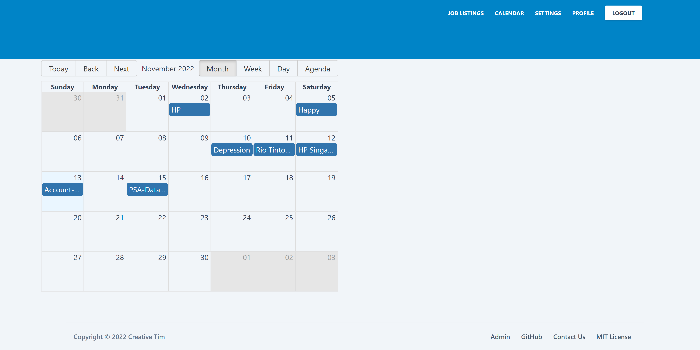
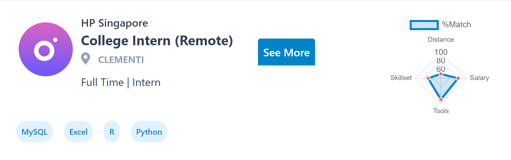
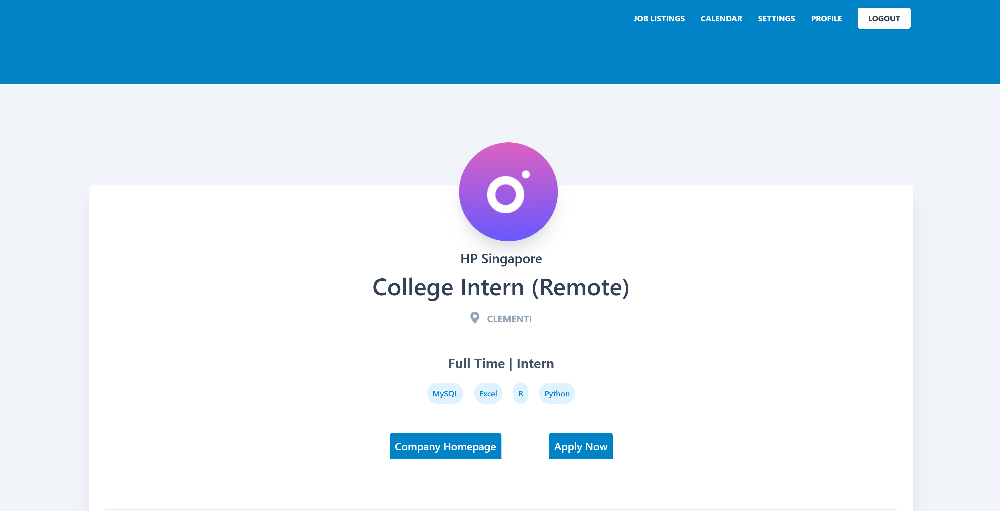
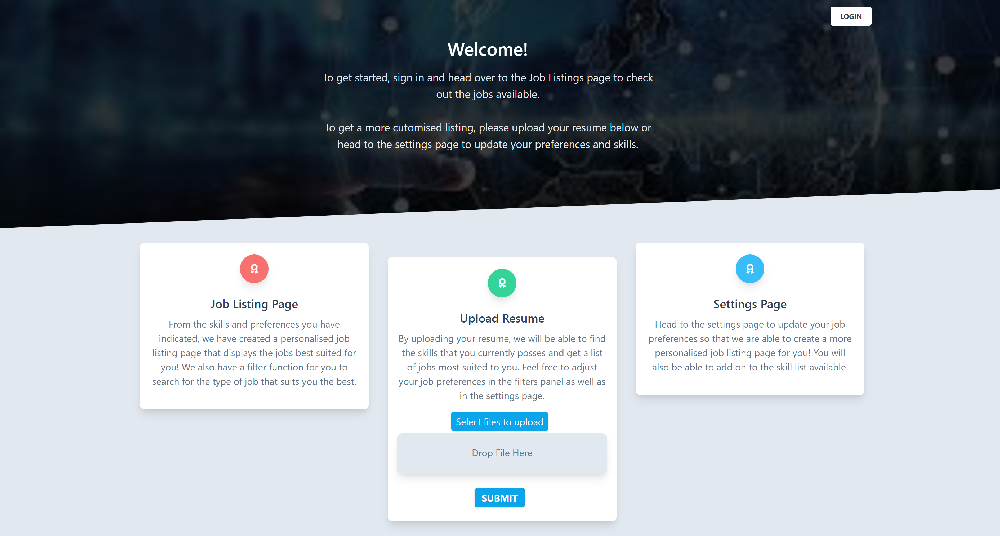
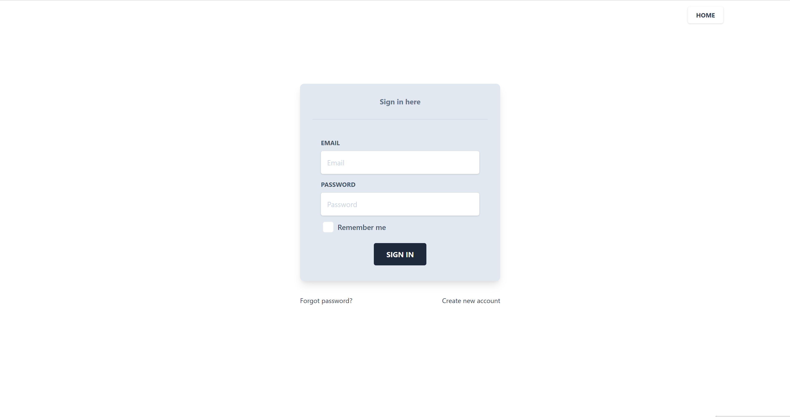
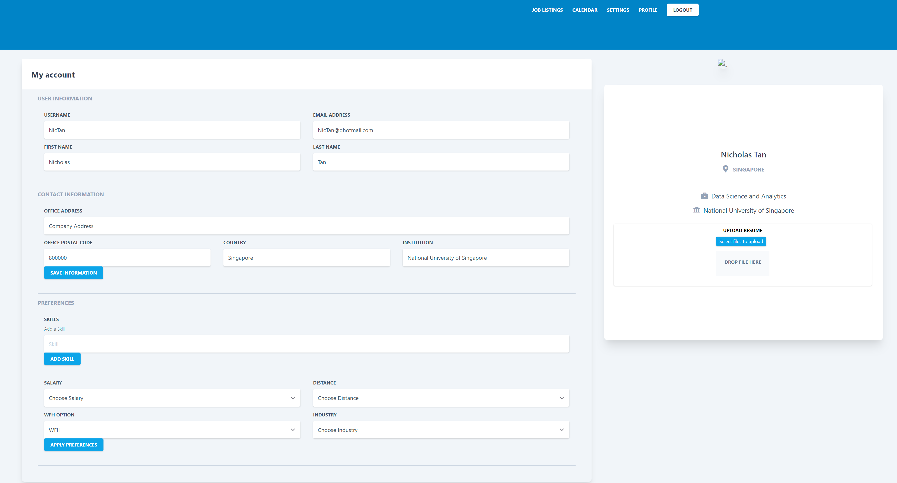
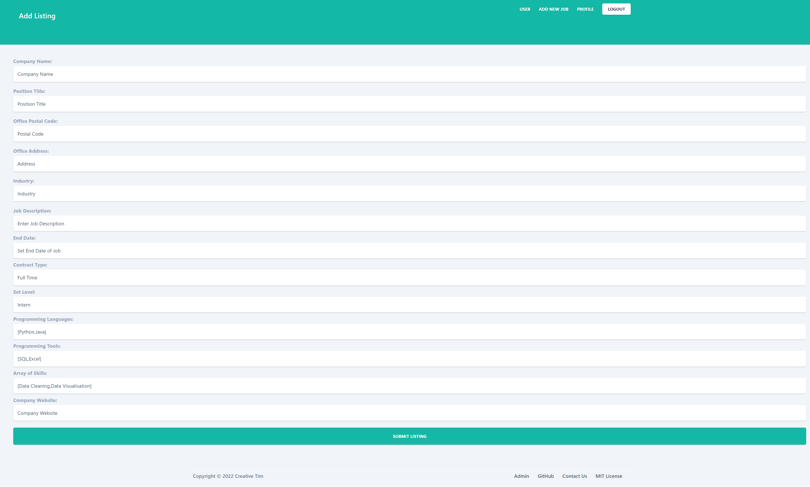

# DSA3101 Data Science in Practice
## Group 06: Data Science Jobs (Front-End)

### Group Members
- Chia Wei Zhe, Brandon
- Kaaviya Selvam
- Megan Michael
- Tan Wei Shuen, Nicholas

### **Introduction**
According to many, Data Science is the sexiest job of the 21st Century. In our fast-moving digitalised world, more and more data are being generated and processed. In fact, a whooping estimate of 2.5 Quintillion bytes of data are being generated every single day! And that’s why Data Scientists are very sought after by many industries today.

With the rise in demand of Data Science, we feel that there is a need for a customised data science job portal, so that future data scientists can find a job that suits one's interests, needs and wants much more efficiently. 

Our portal is mainly catered to Data Science undergraduates who are actively seeking an internship or a job. Regardless if you are looking for your first internship, or a fresh graduate looking for a job, our portal aims to personalise your job search such that you may find a more suited job based on your interests through your resume.

 

### **Welcome to our One-Stop Data Science Job Portal!**

 

## How to Run

Our Job Portal is coded in React.JS, thus do ensure that you have Node.js installed before running our portal.

Run:

`npm start`

Our front-end application will be hosted on `http://localhost:3000/`

 

## Key Application Features

On top of the usual filters of a job portal, we have additionally implemented 3 key features in our application that make us unique.

### 1) Calendar View: 

As different jobs have different job application deadlines, we have decided to create a calendar view for the end-user to view all the deadlines of the various job openings at a glance.

### 2) Radar Graph: 

The radar graph is a personalised spider-like chart which will match the similarity of the job description to your interests/skillsets based on your preferences and your resume. It will also indicate a percentage of how likely you will fit in the job. This will allow the end-user to hopefully make a better informed decision on which jobs to apply for based on their interests.

### 3) Quick Links: 

We have also decided to include relevant links that can be easily accessed from each job description. The end-user may have easy direct access to the company's webpage if they wish to find out more, and also quick link to directly apply for the job.

 

## Our job portal at a glance

We have 5 main pages:
1) Main Landing Page
2) Login/Register Page
3) Job Listing Page
4) Settings Page
5) Admin Page (Only for Employers)

 

### **Main Landing Page**

This is where the end-user will first visit when he/she accesses our job portal. 
To get the end-user started, We have included a resume upload function for the end-user to begin on his/her job search journey. 
At the bottom of the landing page, it has various links to relevant resources that the end-user might find useful as well.

### **Login/Register Page**

Here is where the end-user may sign in using their school account or Google account to have better access to our portal.

### **Job Listing Page**

This is where the end-user may view the various job postings from employers.

This is also where the key features of our app lies. 

### **Settings Page**
Here is where the end-users may upload their resume, update their preferences, and their personal particulars.

### Admin Page
We have also added an Admin page for employers to add a Job Listing. Note: This page is only available to employers, and is not towards end-users. 

 

## Happy viewing our Job Portal! :) 
